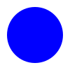

# SVG Example with Enhanced Styling and Responsiveness

This example demonstrates the use of **SVG (Scalable Vector Graphics)** in HTML with additional styling and responsiveness. The examples cover:
- Basic shapes (rectangle and circle).
- Text inside SVG.
- Animated SVG.
- Embedding external SVG and inline SVG.

## HTML Structure Overview

1. **DOCTYPE and HTML Structure:**
   - We start by declaring the `<!DOCTYPE html>` to specify this is an HTML5 document.
   - The `<html>` tag is used to define the document's structure and specifies the language as English (`lang="en"`).
   - Inside the `<head>`, the character set and viewport settings are defined for better compatibility across devices.

2. **Linking External CSS:**
   - The external stylesheet is linked using the `<link>` tag with the `href` attribute pointing to `../assets/styles/style.css`. This file contains the custom styles for the page.

3. **Body Content:**
   - The body contains the following examples and explanations.

---

### Code Breakdown

#### 1. **Basic SVG Example: Rectangle and Circle**
```html
<svg width="300" height="200">
    <rect x="10" y="10" width="100" height="100" fill="blue" />
    <circle cx="200" cy="50" r="40" fill="red" />
</svg>
```
- This SVG creates a rectangle and a circle. The rectangle is positioned at (10,10) and has a width and height of 100 pixels, filled with blue color. The circle is positioned at (200,50) with a radius of 40 pixels, filled with red.

#### 2. **Text Inside SVG**
```html
<svg width="300" height="100">
    <text x="10" y="50" font-family="Arial" font-size="24" fill="green">
        Hello, SVG!
    </text>
</svg>
```
- This SVG shows how to display text inside the SVG canvas. The `<text>` element is used to place the text "Hello, SVG!" at coordinates (10,50), with a font size of 24px, in Arial font, and green color.

#### 3. **Animated SVG: Moving Circle**
```html
<svg width="200" height="200">
    <circle cx="50" cy="50" r="40" fill="purple">
        <animate attributeName="cx" from="50" to="150" dur="2s" repeatCount="indefinite" />
    </circle>
</svg>
```
- Here, an animation is applied to the circle's `cx` (center x-coordinate) attribute. The circle moves horizontally from `50` to `150` pixels in 2 seconds, repeating indefinitely.

#### 4. **External SVG Logo (Embedded Using `` Tag)**
```html

```
- The `` tag is used to display an external SVG logo (in this case, a React logo) from the `assets/svg/logo.svg` file.

#### 5. **Inline SVG with Polygon**
```html
<svg width="300" height="300">
    <polygon points="100,10 40,198 190,78 10,78 160,198"
        style="fill:lime;stroke:purple;stroke-width:5;fill-rule:evenodd;" />
</svg>
```
- This SVG example draws a polygon with a series of points. The `style` attribute adds color and styling, filling the polygon with lime color and applying a purple stroke with a width of 5px.

---

### Key Points:
- **Scalability:** SVGs are scalable and resolution-independent, meaning they will look sharp at any size, making them ideal for logos, icons, and responsive designs.
- **Accessibility:** SVG allows for interactive graphics that can be animated and manipulated through CSS and JavaScript.
- **Flexibility:** SVG elements can be styled using CSS and manipulated through JavaScript, offering full control over their appearance and behavior.
- **File Size:** SVGs are text-based, and therefore, they are lightweight and easy to edit or debug.

For further practice, explore adding more complex shapes and animations to the SVG content in the examples provided.

